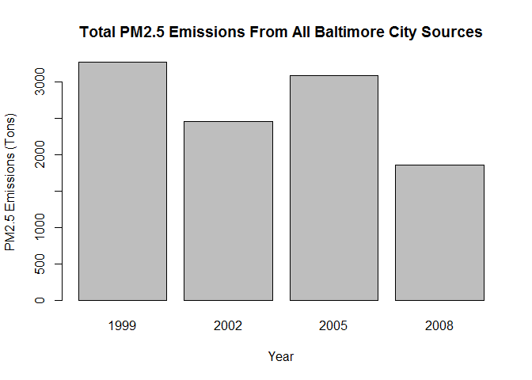
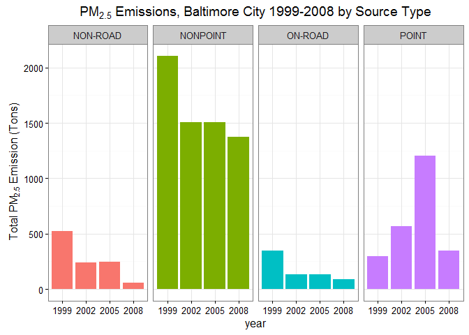
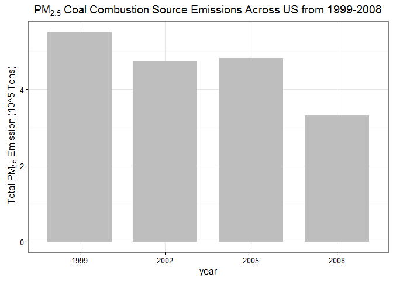
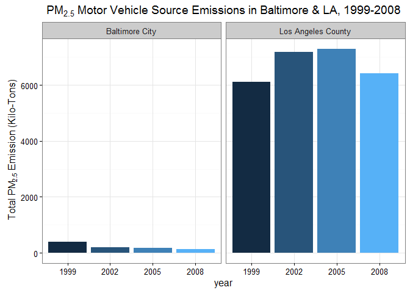

# Exploratory Data Analysis - Course Project 2
Vijay M  
January 30, 2016  

**1 Have total emissions from PM2.5 decreased in the United States from 1999 to 2008? **

######Using the base plotting system, make a plot showing the total PM2.5 emission from all sources
######for each of the years 1999, 2002, 2005, and 2008.


```r
setwd("C:/CourseraProjects/EDA")
```


```r
## Time consuming file read, take few extra seconds
NEI  <- readRDS("summarySCC_PM25.rds")
SCC <- readRDS("Source_Classification_Code.rds")

aggEmissions <- aggregate(Emissions ~ year,NEI, sum)

barplot(
        (aggEmissions$Emissions)/10^6,
        names.arg=aggEmissions$year,
        xlab="Year",
        ylab="PM2.5 Emissions (10^6 Tons)",
        main="Total PM2.5 Emissions From All US Sources"
)
```


**Yes total emissions from PM2.5 decreased in the United States from 1999 to 2008.**


**Q2.Have total emissions from PM2.5 decreased in the Baltimore City, Maryland (fips == "24510") from 1999 to 2008? **

######Use the base plotting system to make a plot answering this question.


```r
## Time consuming file read, take few extra seconds
NEI <- readRDS("summarySCC_PM25.rds")
SCC <- readRDS("Source_Classification_Code.rds")

NEIbal <- NEI[NEI$fips=="24510",]
NEIAggTotbal <- aggregate(Emissions ~ year, NEIbal,sum)

barplot(
        NEIAggTotbal$Emissions,
        names.arg=NEIAggTotbal$year,
        xlab="Year",
        ylab="PM2.5 Emissions (Tons)",
        main="Total PM2.5 Emissions From All Baltimore City Sources"
)
```



**Overall total emissions from PM2.5 have decreased in Baltimore City, Maryland from 1999 to 2008 and slight increase in 2005**


**Q3.Of the four types of sources indicated by the type (point, nonpoint, onroad, nonroad) variable.**

*** which of these four sources have seen decreases in emissions from 1999-2008 for Baltimore City?  ***
*** Which have seen increases in emissions from 1999-2008? Use the ggplot2 plotting system to make a plot answer this question. ***


```r
library(ggplot2)
```

```
## Warning: package 'ggplot2' was built under R version 3.2.3
```

```r
## Time consuming file read, take few extra seconds
NEI <- readRDS("summarySCC_PM25.rds")
SCC <- readRDS("Source_Classification_Code.rds")

NEIbal <- NEI[NEI$fips=="24510",]

ggp <- ggplot(NEIbal,aes(factor(year),Emissions,fill=type)) +
        geom_bar(stat="identity") +
        theme_bw() + guides(fill=FALSE)+
        facet_grid(.~type,scales = "free",space="free") + 
        labs(x="year", y=expression("Total PM"[2.5]*" Emission (Tons)")) + 
        labs(title=expression("PM"[2.5]*" Emissions, Baltimore City 1999-2008 by Source Type"))

print(ggp)
```



**The  point  source saw a slight increase overall from 1999-2008. Also note that the  point  source saw a significant increase until** **2005 at which point it decreases again by 2008 to just above the starting values. **


        
** Q4.Across the United States, how have emissions from coal combustion-related sources changed from 1999-2008? **

###########Note: The SCC levels go from generic to specific. We assume that coal combustion 
###########related SCC records are those where SCC.Level.One contains the substring 'comb' and SCC.Level.
###########Four contains the substring 'coal'.


```r
library(ggplot2)

## Time consuming file read, take few extra seconds
NEI <- readRDS("summarySCC_PM25.rds")
SCC <- readRDS("Source_Classification_Code.rds")

# Subset coal combustion related NEI data
combustionRelated <- grepl("comb", SCC$SCC.Level.One, ignore.case=TRUE)
coalRelated <- grepl("coal", SCC$SCC.Level.Four, ignore.case=TRUE) 
coalCombustion <- (combustionRelated & coalRelated)
combustionSCC <- SCC[coalCombustion,]$SCC
combustionNEI <- NEI[NEI$SCC %in% combustionSCC,]

ggp <- ggplot(combustionNEI,aes(factor(year),Emissions/10^5)) +
        geom_bar(stat="identity",fill="grey",width=0.75) +
        theme_bw() +  guides(fill=FALSE) +
        labs(x="year", y=expression("Total PM"[2.5]*" Emission (10^5 Tons)")) + 
        labs(title=expression("PM"[2.5]*" Coal Combustion Source Emissions Across US from 1999-2008"))

print(ggp)
```



**Emissions from coal combustion related sources have decreased from 6 * 10^6 to below 4 * 10^6 from 1999-2008.**

# 5.How have emissions from motor vehicle sources changed from 1999-2008 in Baltimore City?

```r
library(ggplot2)

## Time consuming file read, take few extra seconds
NEI <- readRDS("summarySCC_PM25.rds")
SCC <- readRDS("Source_Classification_Code.rds")

#.First we subset the motor vehicles, which we assume is anything like Motor Vehicle in SCC.Level.Two.
vehicles <- grepl("vehicle", SCC$SCC.Level.Two, ignore.case=TRUE)
vehiclesSCC <- SCC[vehicles,]$SCC
vehiclesNEI <- NEI[NEI$SCC %in% vehiclesSCC,]

#.Next we subset for motor vehicles in Baltimore,
baltimoreVehiclesNEI <- vehiclesNEI[vehiclesNEI$fips==24510,]

#.Finally we plot using ggplot2,
ggp <- ggplot(baltimoreVehiclesNEI,aes(factor(year),Emissions)) +
        geom_bar(stat="identity",fill="grey",width=0.75) +
        theme_bw() +  guides(fill=FALSE) +
        labs(x="year", y=expression("Total PM"[2.5]*" Emission (10^5 Tons)")) + 
        labs(title=expression("PM"[2.5]*" Motor Vehicle Source Emissions in Baltimore from 1999-2008"))

print(ggp)
```


**Emissions from motor vehicle sources have decreased from 1999-2008 in Baltimore City!**

**Q6.Compare emissions from motor vehicle sources in Baltimore City with emissions from motor vehicle**
**sources in Los Angeles County, California (fips == "06037").** 
**Which city has seen greater changes over time in motor vehicle emissions?**


```r
library(ggplot2)

## Time consuming file read, take few extra seconds
NEI <- readRDS("summarySCC_PM25.rds")
SCC <- readRDS("Source_Classification_Code.rds")

vehicles <- grepl("vehicle", SCC$SCC.Level.Two, ignore.case=TRUE)
vehiclesSCC <- SCC[vehicles,]$SCC
vehiclesNEI <- NEI[NEI$SCC %in% vehiclesSCC,]

#.sources in Los Angeles County, California (fips == "06037"),
vehiclesBaltimoreNEI <- vehiclesNEI[vehiclesNEI$fips == 24510,]
vehiclesBaltimoreNEI$city <- "Baltimore City"
vehiclesLANEI <- vehiclesNEI[vehiclesNEI$fips=="06037",]
vehiclesLANEI$city <- "Los Angeles County"
bothNEI <- rbind(vehiclesBaltimoreNEI,vehiclesLANEI)

#.Now we plot using the ggplot2 system,
ggp <- ggplot(bothNEI, aes(x=factor(year), y=Emissions, fill=city)) +
        geom_bar(aes(fill=year),stat="identity") +
        facet_grid(scales="free", space="free", .~city) +
        guides(fill=FALSE) + theme_bw() +
        labs(x="year", y=expression("Total PM"[2.5]*" Emission (Kilo-Tons)")) + 
        labs(title=expression("PM"[2.5]*" Motor Vehicle Source Emissions in Baltimore & LA, 1999-2008"))

print(ggp)
```



** Comparing to Baltimore city thier is wide contrast to Loss Angeles County. **
** Angeles County has seen the greatest changes over time in motor vehicle emissions**


